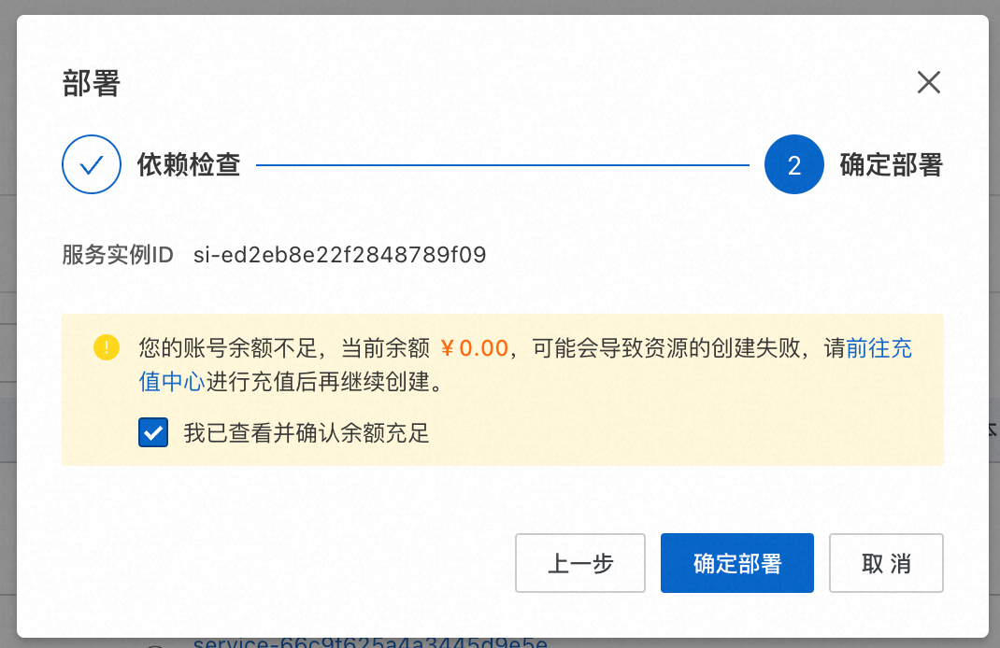

# 服务模版说明文档

## 服务说明

本文介绍基于WordPress软件包快速构建托管版单租户计算巢服务，关于计算巢托管版可以参考[帮助文档](https://help.aliyun.com/zh/compute-nest/create-a-fully-managed-service?spm=a2c4g.11174283.0.i5)，
本示例采用ECS+SLB+EIP的高可用架构。规格参数都可以由租户自行选择。

本示例对应的git地址：[wordpress-managed-demo](https://github.com/aliyun-computenest/wordpress-managed-demo)

本示例会自动的构建计算巢服务，具体的服务构建流程为:

1. 将WordPress安装包（提前存放到该github repo中）构建为计算巢文件部署物
2. 创建计算巢服务并关联文件部署物

创建过程大约持续3分钟，当服务变成待提交后构建成功

## 部署架构

本部署架构为ECS+SLB+EIP，安全组开放租户指定的Wordpress（默认为8080）端口，通过公网EIP进行访问，架构图：


## 服务构建计费说明

测试本服务构建无需任何费用，创建服务实例涉及的费用参考服务实例计费说明

## RAM账号所需权限

本服务需要对ECS、VPC等资源进行访问和创建操作，若您使用RAM用户创建服务实例，需要在创建服务实例前，对使用的RAM用户的账号添加相应资源的权限。添加RAM权限的详细操作，请参见[为RAM用户授权](https://help.aliyun.com/document_detail/121945.html)
。所需权限如下表所示。

| 权限策略名称                              | 备注                          |
|-------------------------------------|-----------------------------|
| AliyunECSFullAccess                 | 管理云服务器服务（ECS）的权限            |
| AliyunVPCFullAccess                 | 管理专有网络（VPC）的权限              |
| AliyunROSFullAccess                 | 管理资源编排服务（ROS）的权限            |
| AliyunSLBFullAccess                 | 管理负载均衡服务(SLB)的权限            |
| AliyunCloudMonitorFullAccess        | 管理云监控（CloudMonitor）的权限      |
| AliyunComputeNestUserFullAccess     | 管理计算巢服务（ComputeNest）的用户侧权限  |
| AliyunComputeNestSupplierFullAccess | 管理计算巢服务（ComputeNest）的服务商侧权限 |

## 服务实例计费说明

测试本服务在计算巢上的费用主要涉及：

- 所选vCPU与内存规格
- 系统盘类型及容量
- 负载均衡规格
- 公网带宽
- 私网连接费用

计费方式包括：

- 按量付费（小时）
- 包年包月

## 部署流程

### 部署参数说明

| 参数组         | 参数项             | 示例                   | 说明                                                                      |
|-------------|-----------------|----------------------|-------------------------------------------------------------------------|
| 服务实例名称      |                 | test                 | 实例的名称                                                                   |
| 资源组和地域      | 资源组             | 默认资源组                | 创建的服务实例位于的资源组                                                           |
| 资源组和地域      | 地域              | 华东1（杭州）              | 选中服务实例的地域，建议就近选中，以获取更好的网络延时。                                            |
| 付费类型配置      | 付费类型            | 按量付费 或 包年包月          |
| ECS实例配置     | 实例类型            | ecs.gn6i-c4g1.xlarge | 实例规格，可以根据实际需求选择                                                         |
| ECS实例配置     | 系统盘空间           | 40                   | 系统盘大小，可以根据实际需求选择                                                        |
| ECS实例配置     | 流量付费类型          | PayByTraffic         | 流量付费类型，可以根据实际需求选择                                                       |
| ECS实例配置     | 流量公网带宽          | 10                   | 流量公网带宽，可以根据实际需求选择                                                       |
| ECS实例配置     | 实例密码            | *******              | 设置实例密码。长度830个字符，必须包含三项（大写字母、小写字母、数字、()`!@#$%^&*-+={}[]:;'<>,.?/ 中的特殊符号） |
| 负载均衡配置      | 负载均衡实例规格        | slb.s2.small         | 负载均衡实例规格，可以根据实际需求选择                                                     |
| 数据库配置       | 实例系列            | 高可用版                 | RDS实例系列，可以根据实际需求选择                                                      |
| 数据库配置       | 实例规格            | mysql.n2.medium.1    | RDS实例规格，可以根据实际需求选择                                                      |
| 数据库配置       | 实例存储            | 50                   | RDS实例大小，可以根据实际需求选择                                                      |
| 数据库配置       | 数据库名            | wordpress            | WordPress数据库名                                                           |
| 数据库配置       | 数据库账号           | wpuser               | WordPress数据库账号                                                          |
| 数据库配置       | 数据库密码           | ********             | 设置实例密码。长度830个字符，必须包含三项（大写字母、小写字母、数字、()`!@#$%^&*-+={}[]:;'<>,.?/ 中的特殊符号） |
| WordPress配置 | WordPress 监听端口号 | 8080                 | WordPress网站监听端口号                                                        |
| 可用区配置       | 部署区域            | 可用区I                 | 地域下的不同可用区域                                                              |
| 选择已有基础资源配置  | VPC ID          | vpc-xxx              | 选择专有网络的ID。                                                              |
| 选择已有基础资源配置  | 交换机ID           | vsw-xxx              | 选择交换机ID。若找不到交换机, 可尝试切换地域和可用区                                            |

### 部署步骤

0. 部署链接
   
1. 单击部署链接，进入服务实例部署界面，根据界面提示，填写参数完成部署。
   
2. 参数填写完成后可以看到对应参数，确认参数后点击**立即创建**，进入部署阶段。
   

   
3. 租户侧可以看到服务实例处于待部署状态。
   
4. 服务商可以点击部署，开始进入部署阶段、
   
   
   
5. 等待部署完成后就可以开始使用服务，打开浏览器访问WordPress主页，输入用户名和密码即可访问WordPress网站。
   
   
   

## 服务详细说明

本文提前将WordPress安装包存放到该Github Repo中，构建服务过程中会将该安装包发布为计算巢部署物，并在ROS模板写入安装指令，ROS模板引擎在执行时便会自动执行安装了。

```bash
# 安装wordPress
wget '{{ computenest::file::wordpress }}' -O wordpress-6.2-zh_CN.tar.gz
tar -xvf wordpress-6.2-zh_CN.tar.gz
cp wordpress/wp-config-sample.php wordpress/backup-wp-config.php
sed -i 's/database_name_here/${DBName}/' wordpress/wp-config-sample.php
sed -i 's/username_here/${DBUser}/' wordpress/wp-config-sample.php
sed -i 's/password_here/${DBPassword}/' wordpress/wp-config-sample.php
sed -i 's/localhost/${DBConnectString}/' wordpress/wp-config-sample.php
mv wordpress/wp-config-sample.php wordpress/wp-config.php
cp wordpress/backup-wp-config.php wordpress/wp-config-sample.php
cp -a wordpress/* $WebRootPath
rm -rf wordpress*
usermod -d $WebRootPath apache &>/dev/null
chown apache:apache -R $WebRootPath
chmod -R 755 $WebRootPath/wordpress
sed -i "s/$ApacheIndex/$ApacheIndexReplace/" /etc/httpd/conf/httpd.conf
systemctl restart httpd
```

{{ computenest::file::wordpress }} 为占位符，会由计算巢服务替换成文件部署物wordpress的http下载地址

文件说明

| 文件路径                                | 说明                                                                                                                   |
|-------------------------------------|----------------------------------------------------------------------------------------------------------------------|
| config.yaml                         | 构建服务的配置文件，服务构建过程中会使用计算巢命令行工具[computenest-cli](https://pypi.org/project/computenest-cli/)，computenest-cli会基于该配置文件构建服务 |
| parameters.yaml                     | 本服务为托管版单租，使用该文件渲染服务商需要配置的网络参数，包括VpcId，VSwitch等                                                                       |
| artifact/wordpress-6.2-zh_CN.tar.gz | wordpress，构建过程会将该包发布为计算巢部署物                                                                                          |
| icons/service_logo.jpg              | 构建服务默认的图标                                                                                                            |
| templates/parameters.yaml           | 本服务为托管版单租服务，所以只需要用户填写一部分参数，通过该文件指定用户所填参数                                                                             |
| templates/template.yaml             | ROS模板文件，ROS模板引擎根据该模板能够自动创建出所有的资源                                                                                     |